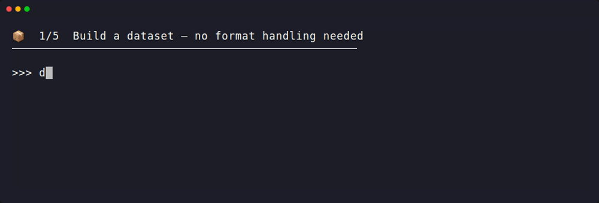

<p align="center">
  
</p>

# Datamint Python API


[](https://www.python.org/downloads/)

Datamint turns medical imaging ML work. Dataset management, annotation, training, and deployment into a few lines of Python, with built-in support for DICOM/NIfTI/PNG, PyTorch Lightning trainers, and MLflow tracking.

**Common use cases:** 🩻 Segmentation · 🏷️ Classification · 📦 Detection

## 📋 Table of Contents

- [See it in action](#-see-it-in-action)
- [Features](#-features)
- [Quick Start](#-quick-start)
- [Documentation](#-documentation)
- [Support](#-support)

## 🎬 See it in action

From a project name to a deployed, validated model, patient-wise splitting, training, and deployment included:



## 🚀 Features

- **Dataset Management**: Download, upload, and manage medical imaging datasets using intuitive object-based APIs or CLI tools
- **Annotation Tools**: Create, upload, and manage annotations (segmentations, labels, measurements) with ease
- **Experiment Tracking**: Seamless support for experiment management via MLflow integration
- **PyTorch Lightning Integration**: Streamlined machine learning workflows featuring specialized `LightningDataModules`, built-in trainers (`SegmentationTrainer`), and automated MLflow checkpoint logging
- **DICOM Support**: Native handling of DICOM files, including powerful anonymization capabilities during upload to protect patient privacy
- **Multi-format Support**: Robust support for a wide range of medical imaging formats: PNG, JPEG, NIfTI (NIfTI/NRRD), DICOMs and more

## ⚡ Quick Start

**1. Install**

`pip install -U datamint`

<details>
<summary>Using a virtual environment (recommended)</summary>

We recommend that you install Datamint in a dedicated virtual environment, to avoid conflicting with your system packages.
For instance, create the enviroment once with `python3 -m venv datamint-env` and then activate it whenever you need it with:

1. **Create the environment** (one-time setup):
   ```bash
   python3 -m venv datamint-env
   ```

2. **Activate the environment** (run whenever you need it):

   | Platform | Command |
   |----------|---------|
   | Linux/macOS | `source datamint-env/bin/activate` |
   | Windows CMD | `datamint-env\Scripts\activate.bat` |
   | Windows PowerShell | `datamint-env\Scripts\Activate.ps1` |

3. **Install the package**:
   ```bash
   pip install datamint
   ```

</details>

**2. Configure your API key**

```bash
datamint-config
```

Follow the prompts (ask your administrator if you don't have a key yet). Environment variable and programmatic options are in the [Setup API Key guide](https://sonanceai.github.io/datamint-python-api/getting_started.html#setup-api-key).

**3. Scaffold a project — the fastest way to start**

```bash
datamint-init
```

This is the recommended on-ramp: it asks for a project name and task type (**segmentation**, **classification**, or **detection**), then generates a ready-to-run, numbered set of scripts (`01_upload_data.py` → `06_deploy.py`) — upload data, train, and deploy by running them in order.

**4. ...or write it yourself**

```python
from datamint import Api
from datamint.lightning import UNetPPTrainer

api = Api()
trainer = UNetPPTrainer(project="my-project")
results = trainer.fit()
```

## 📚 Documentation

| Resource | Description |
|----------|-------------|
| [🚀 Getting Started](https://sonanceai.github.io/datamint-python-api/getting_started.html) | Step-by-step setup and basic usage |
| [📖 API Reference](https://sonanceai.github.io/datamint-python-api/client_api.html) | Complete API documentation |
| [🔥 PyTorch Integration](https://sonanceai.github.io/datamint-python-api/pytorch_integration.html) | ML workflow integration |
| [🧠 Trainer Guide](https://sonanceai.github.io/datamint-python-api/trainer_api.html) | Built-in trainers, trainer lifecycle, and custom model integration |
| [🛠️ Command Line Tools](https://sonanceai.github.io/datamint-python-api/command_line_tools.html) | Full reference for `datamint-upload`, `datamint-init`, and `datamint-config` |
| [🔒 SSL Troubleshooting](https://sonanceai.github.io/datamint-python-api/ssl_troubleshooting.html) | Fixing `SSLCertVerificationError` |
| [📓 Notebooks](notebooks/) | Numbered, runnable tutorials. Start at `01_getting_started` and work through annotations, datasets, experiment tracking, deployment, and a full end-to-end example |

## 🆘 Support

[Full Documentation](https://sonanceai.github.io/datamint-python-api)  
[GitHub Issues](https://github.com/SonanceAI/datamint-python-api/issues)
