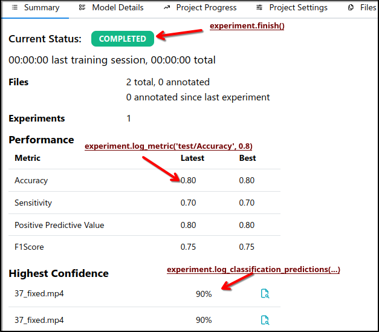

Running Experiments
===================

The :py:class:`~datamintapi.experiment.experiment.Experiment` class allows you to log your experiments to the server.
It contains mechanisms to automatically log the model, the dataset, the hyperparameters,
and the results of your experiments without any extra effort.
Here is an example on how to use it:

.. code-block:: python
    
    from datamintapi import Experiment

    # Create an instance of the Experiment class
    exp = Experiment(name="Experiment",
                     project_name='Project Name'
                     )
    train_dataset = exp.get_dataset('train')
    test_dataset = exp.get_dataset('test')
    
    # Train/Test your model here
    # (...)
    exp.finish()

The above code will automatically collect and log all these information to the server:

.. list-table:: Experiment Logging
   :header-rows: 1

   * - Automatically Logged
     - Method to Log Manually
     - Frequency (when automatically logged)
   * - Model
     - :py:meth:`~datamintapi.experiment.experiment.Experiment.log_model`
     - Once, at :py:meth:`~datamintapi.experiment.experiment.Experiment.finish`
   * - Dataset
     - :py:meth:`~datamintapi.experiment.experiment.Experiment.log_dataset_stats`
     - When :py:meth:`~datamintapi.experiment.experiment.Experiment.get_dataset` is called
   * - Hyperparameters
     - :py:meth:`~datamintapi.experiment.experiment.Experiment.log_model`
     - Once, at :py:meth:`~datamintapi.experiment.experiment.Experiment.finish`
   * - Metrics
     - :py:meth:`~datamintapi.experiment.experiment.Experiment.log_metrics` and :py:meth:`~datamintapi.experiment.experiment.Experiment.log_metric`
     - Per epoch and per dataloader
   * - Predictions
     - :py:meth:`~datamintapi.experiment.experiment.Experiment.log_predictions`
     - Per evaluation and per dataloader

Check an full functional example at `experiment_traintest_classifier.py <https://github.com/SonanceAI/datamint-python-api/blob/feat/experiment-class/examples/experiment_traintest_classifier.py>`_


Manual logging
--------------
For complex experiments, you may need to log manually log additional information that is not automatically collected by the |ExperimentClass|.
You can do that by using the |ExperimentClass| methods.
To disable automatic logging, set ``auto_log=False`` when creating the |ExperimentClass| object.

Manual Summary logging
++++++++++++++++++++++
Here is a complete example that manually logs everything required by the summary UI tab:

.. _experiment_example_code_1:
.. code-block:: python

    from datamintapi import Experiment
    import numpy as np

    # Create an experiment object
    exp = Experiment(name='My first experiment',
                    project_name='testproject',
                    allow_existing=True,
                    auto_log=False)
    
    # Logs metrics
    exp.log_metric('test/Sensitivity', 0.7) # a.k.a. Recall
    exp.log_metric('test/Positive Predictive Value', 0.8)  # a.k.a. Precision
    exp.log_metric('test/F1Score', 0.75)
    exp.log_metric('test/Accuracy', 0.8)

    # Logs predictions.
    predictions_conf = np.array([[0.5, 0.2], [0.1, 0.4]])
    resource_ids = exp.get_dataset('test').get_resources_ids()[:2]
    label_names = ['fracture', 'tumor'] # or `exp.get_dataset('test').labels_set`
    exp.log_classification_predictions(predictions_conf,
                                        label_names=label_names,
                                        resource_ids=resource_ids,
                                        dataset_split='test')
    exp.finish()

The effects of the above code can be seen in the image below:



Manual Model details logging
+++++++++++++++++++++++++++++

There are multiple detailed info that can be logged during the training of a model:

- **Metrics along epochs/steps** such as loss, accuracy and sensitivity. For this, use :py:meth:`~datamintapi.experiment.experiment.Experiment.log_metric` with ``epoch=i`` and ``name="train/{METRIC_NAME}"`` or ``name="val/{METRIC_NAME}"``.
- **Predictions:** The model's predictions on the validation/test set. Useful to build curves such as ROC and Precision-Recall. For this, use :py:meth:`~datamintapi.experiment.experiment.Experiment.log_classification_predictions`.
- **Hyperparameters:** the hyperparameters used to train the model. For this, use the ``hyper_params`` parameter of :py:meth:`~datamintapi.experiment.experiment.Experiment.log_model`. Some hyperparameters are automatically logged by default, such as the number of layers, number of parameters, and the model attributes.
- **Environment:** The environment used to train the model. This is automatically collected by default. Disable it by ``log_enviroment=False``` when creating the |ExperimentClass| object.
- **Model:** The model itself. For this, use :py:meth:`~datamintapi.experiment.experiment.Experiment.log_model`.

Here is an example of how to log the metrics along epochs during the training of a model:

.. code-block:: python

    # Logs metrics at epoch 0
    cur_epoch = 0
    exp.log_metric('train/Sensitivity', 0.5, epoch=cur_epoch)
    exp.log_metric('train/loss', 0.9, epoch=cur_epoch)
    exp.log_metric('val/Sensitivity', 0.4, epoch=cur_epoch)
    exp.log_metric('val/loss', 1.1, epoch=cur_epoch)
    # (...)

    # Logs metrics at epoch 1
    cur_epoch = 1
    exp.log_metric('train/Sensitivity', 0.55, epoch=cur_epoch)
    exp.log_metric('train/loss', 0.8, epoch=cur_epoch)
    exp.log_metric('val/Sensitivity', 0.45, epoch=cur_epoch)
    exp.log_metric('val/loss', 1.0, epoch=cur_epoch)
    # (...)

To log you model, you can use the following code:

.. code-block:: python

    # definition of a custom model
    class MyModel(nn.Module):
        def __init__(self, hidden_size=32):
            super().__init__()
            self.hidden_size = hidden_size
            self.fc = nn.Sequential(
                nn.Linear(64, self.hidden_size),
                nn.ReLU(),
                nn.Linear(self.hidden_size, 1)
            )

        def forward(self, x):
            return self.fc(x)

    model = MyModel(hidden_size=32) 
    hyper_params = {'learning_rate': 0.001, 'batch_size': 32}
    exp.log_model(model, hyper_params=hyper_params) # `hidden_size`` will be automatically logged
    # use `log_model_attributes=False` to avoid logging the model attributes

It is possible to pass the file path of the model to be logged as well:

.. code-block:: python

    # (...)
    exp.log_model('model.pth')

To log predictions at a given step/epoch, you can use the same :ref:`example code <experiment_example_code_1>` from Section `Manual Summary logging`_,
but with the ``epoch`` or ``step`` parameter set to the desired value:

.. code-block:: python

    # (...)
    exp.log_classification_predictions(predictions_conf,
                                        label_names=label_names,
                                        resource_ids=resource_ids,
                                        dataset_split='test',
                                        epoch=0)


Best Practices
--------------
- When logging metrics, use '/' to separate different levels of metrics. For example, 'train/loss' and 'test/loss'.
- Use :py:meth:`~datamintapi.experiment.experiment.Experiment.get_dataset` to get the dataset object, instead of directly using |DatamintDatasetClass|. This ensures that all relevant metadata and configurations are correctly applied and that the dataset stats are logged (when ``auto_log=True``).
- Regularly log metrics and other relevant information to keep track of the experiment's progress. Don't forget to provide epoch/step when possible.
- Use meaningful names for your experiments, datasets, to make it easier to identify and compare different runs.
- Use ``dry_run=True`` parameter of |ExperimentClass| for testing/debugging purposes. It will not log anything to the server.