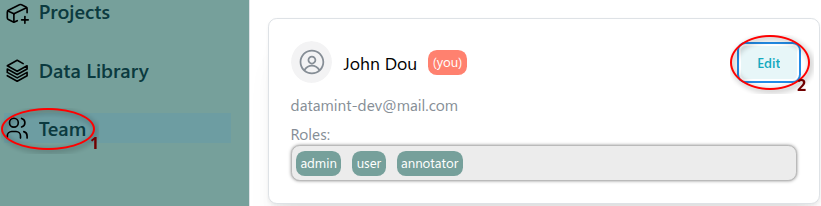
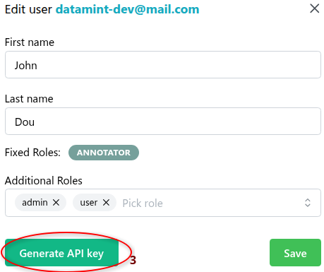

.. _setup_api_key:

Setup API key
=============
To use the Datamint API, you need to set up your API key.
If you have the necessary permissions, you can obtain one from the UI:

1. In the left sidebar, select **Teams**.
2. Click **Edit** on your user profile.

|

3. Click **Generate API key** to create a new API key.

.. note::

   If you don't have the necessary permissions, ask your administrator.

|

Once you have your API key, use one of the following methods to configure it:

Method 1: Command-line tool (recommended)
-------------------------------------------
Run ``datamint-config`` in the terminal and follow the instructions. See :doc:`command_line_tools` for more details.

Method 2: Environment variable
------------------------------
Specify the API key as an environment variable.

.. tab-set::

    .. tab-item:: Bash

        .. code-block:: bash

            export DATAMINT_API_KEY="my_api_key"
            # run your commands (e.g., `datamint-upload`, `python script.py`)

    .. tab-item:: Python

        .. code-block:: python

            import os
            os.environ["DATAMINT_API_KEY"] = "my_api_key"

Method 3: Api constructor
-------------------------
Specify API key in the |ApiClass| constructor:

.. code-block:: python

    from datamint import Api

    api = Api(api_key='my_api_key')